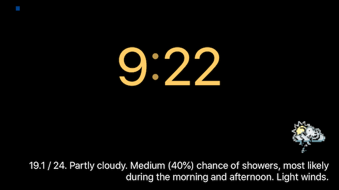

ClockRadio
====================

Features
---------------------

Control is via three [Flic](http://flic.io) buttons, or gestures: Swipe left/right to change stations. Swipe up to set sleep timer, swipe down to turn off.

The time is shown, in large friendly digits. The time separators flash.
Internet audio streams can be played, easily.

The current weather and a weather forecast is shown during the day. In the morning a weather radar is shown.  
At night, just the current temperature is shown.

An alarm turns on the radio.

iTunes album artwork is displayed from the iTunes store for the currently playing track.  
This feature is only available for radio stations which embed metadata into their audio streams.

Features missing
---------------------

A preferences window.

How to customise
---------------------

The SketchUp model for my 3D printed Flic button holder is in the Art folder.

All preferences are currently set in code.
General preferences are in `Preferences.swift`. Radio preferences are in `Stations.json`.

**You will need a [OpenWeather](https://openweathermap.org) API key to receive weather information.**  
You will need to set this key in `OpenWeatherAPIKey.swift`.

Flic button instructions
---------------------

Assume the buttons are arranged in a row in front of the phone, like so: [X X X]  

Buttons are identified by the app by name. The buttons need to be named: "left", "middle" and "right". Case doesn't matter.  
The first time you start the app you need to 'grab' each Flic button. To do this click the hamburger ("&#x11054;") symbol in the top left of the app. Repeat this for each of the three buttons.

Use the left and right buttons to move between stations. 

Pressing the centre button turns on the radio and steps over each available sleep time.  
Holding down the centre button turns OFF the radio.

License
-------
This work is licensed under a Creative Commons Attribution-ShareAlike 4.0 License.  
[http://creativecommons.org/licenses/by-sa/4.0/](http://creativecommons.org/licenses/by-sa/4.0/)

Acknowledgements  
---------------------

[OpenWeather](https://openweathermap.org) and [Australia Bureau of Meteorology](https://openweathermap.org) is used for weather. 

MorningHasBroken.mp3 by acclivity is used for the alarm when a network isn't available.  
[https://freesound.org/people/acclivity/sounds/21199/#](https://freesound.org/people/acclivity/sounds/21199/#)  
It is licensed under the Attribution Noncommercial License:  
[http://creativecommons.org/licenses/by-nc/3.0/](http://creativecommons.org/licenses/by-nc/3.0/)

